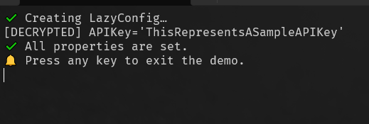

## 💻 Lazy Config


## 📝 v1.0.0.0 - June 2025

**Dependencies**

| Assembly | Version |
| ---- | ---- |
| .NET Core | 6.0 |
| .NET Framework | 4.8 |

## 📰 Description
- A duplicate-aware logging library for reducing unnecessary log entries.
- This library offers synchronous and asynchronous write methods.
- This project includes compilation outputs for both **.NET Framework 4.8** and **.NET Core 6.0**

## 🎛️ Library Usage


```csharp

    /** Samples **/

    // Make sure salt is consistent across machines (and obfuscated)
    string temp = Convert.ToBase64String("f94aaa0dacf2454fb0b8ab2aa8ec1465".ToByteArray());
    byte[] salt = Convert.FromBase64String(temp);

    var portable = new AesPortableEncryptor("super-secret-passphrase", salt);
    
    Console.WriteLine("✔️ Creating LazyConfig…");
    _config = new LazyConfig(encryptor: portable);
    var cv = _config.CompatibleVersion;
    
    // Is this our first run?
    if (string.IsNullOrEmpty(cv))
    {
        _config.CompatibleVersion = "1.0.0";
        _config.FirstRun = true;
        _config.Logging = false;
        _config.LastUse = DateTime.MinValue;
        _config.User = $"{Environment.UserDomainName}";
        _config.PositionX = 100;
        _config.PositionY = 100;
        _config.APIKey = "ThisRepresentsASampleAPIKey";
    }
    else
    {
        _config.FirstRun = false;

       Console.WriteLine($"[DECRYPTED] APIKey='{_config.APIKey}'");

        // Warn the user for unset properties
        List<string> emptyProps = Extensions.GetEmptyStringProperties(_config, "You should configure a value here.");
        if (emptyProps.Count > 0)
        {
            Console.WriteLine("⚠️ Warning: The following properties are empty:");
            foreach (var prop in emptyProps)
                Console.WriteLine($"  - {prop}");
        }
        else
        {
            Console.WriteLine("✔️ All properties are set.");
        }
    }

    Console.WriteLine($"🔔 Press any key to exit the demo.");
    _ = Console.ReadKey(true).Key;

    // Setting any property causes the file to be updated.
    _config.LastUse = DateTime.Now;

```

## 🎛️ Running SampleApp

- `C:\> SampleApp`

- `PS> .\SampleApp`

## 📷 Screenshot



## 🧾 License/Warranty
* Permission is hereby granted, free of charge, to any person obtaining a copy of this software and associated documentation files (the "Software"), to deal in the Software without restriction, including without limitation the rights to use, copy, modify, merge, publish and distribute copies of the Software, and to permit persons to whom the Software is furnished to do so, subject to the following conditions: The above copyright notice and this permission notice shall be included in all copies or substantial portions of the Software.
* The software is provided "as is", without warranty of any kind, express or implied, including but not limited to the warranties of merchantability, fitness for a particular purpose and noninfringement. In no event shall the author or copyright holder be liable for any claim, damages or other liability, whether in an action of contract, tort or otherwise, arising from, out of or in connection with the software or the use or other dealings in the software.
* Copyright © 2025. All rights reserved.

## 📋 Proofing
* This application was compiled and tested using *VisualStudio* 2022 on *Windows 10/11* versions **22H2**, **21H2**, **21H1**, and **23H2**.

